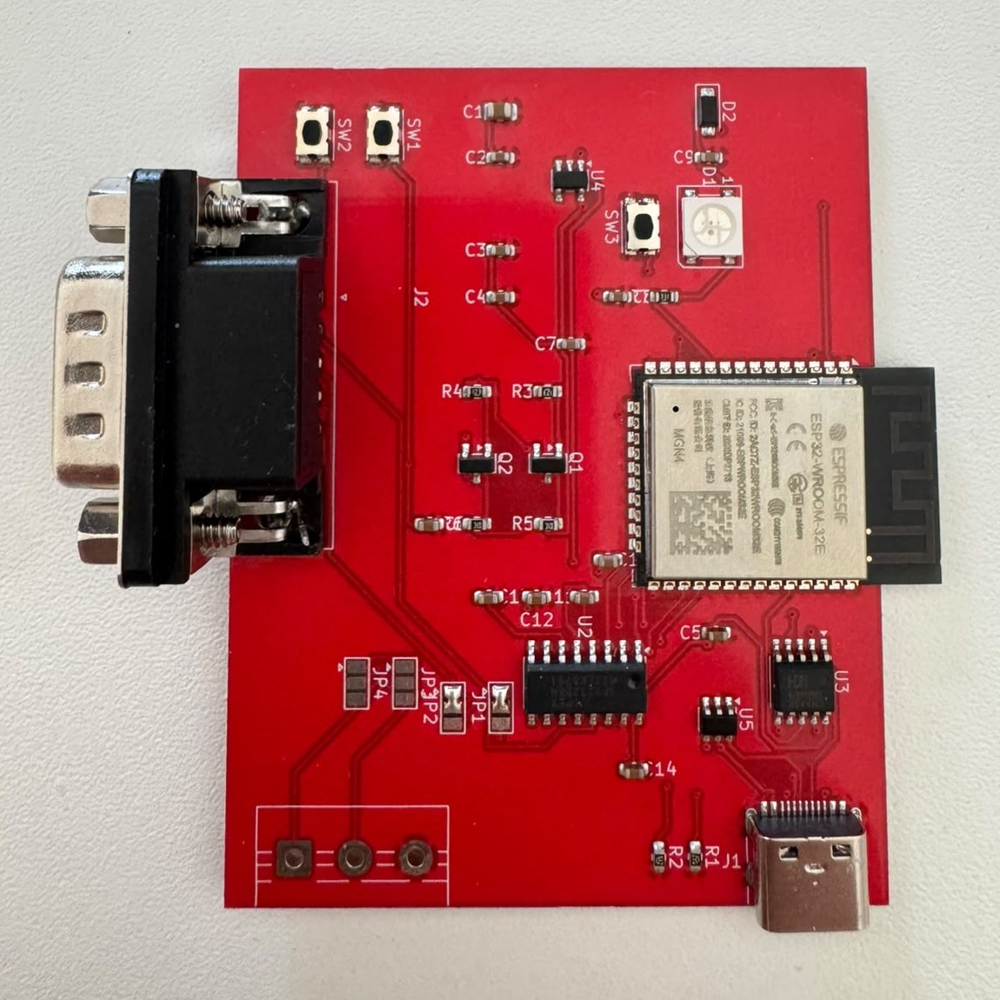
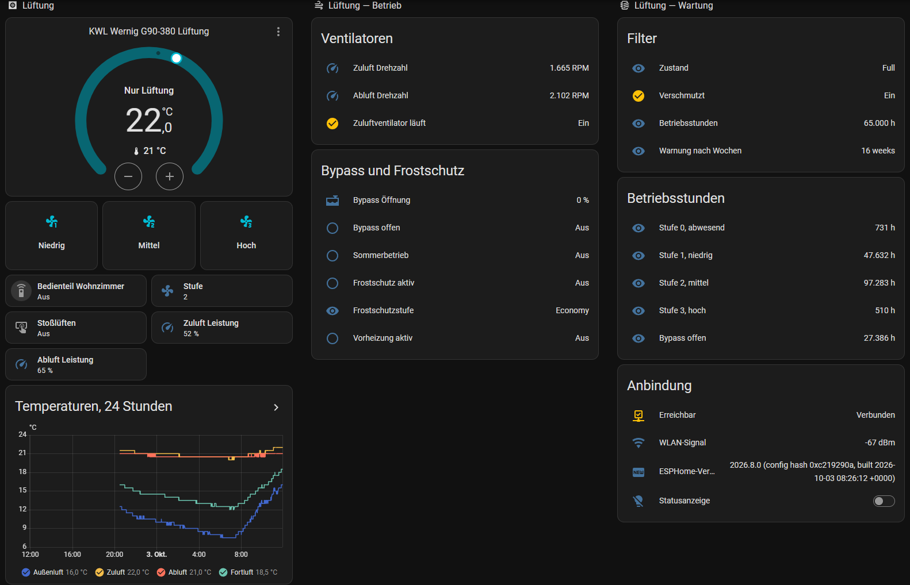

# comfoair-esp32

**Connect your Zehnder ComfoAir, StorkAir WHR or Wernig G90 ventilation unit to Home Assistant — locally, without cloud and without MQTT.**

[Deutsch](README.md) · [Project page](https://hpralfi.github.io/comfoair-esp32/)

A small ESP32 board that plugs into the **"RS232 PC"** port of ventilation units built on the Zehnder CA350 control board. It runs [ESPHome](https://esphome.io) and shows up in Home Assistant with over 40 entities: temperatures, fan levels and speeds, bypass, filter status, frost protection, operating hours.

It was built to replace a Gira HomeServer + Moxa serial gateway on a Wernig G90-380 and has been running on that unit since October 2026.

## Features

- **Native Home Assistant integration** via the ESPHome API — no MQTT broker, no cloud
- **All values of the unit**: four temperatures, level, fan power and rpm, bypass, filter, frost protection, preheating, operating hours per level
- **Control**: ventilation level 0–3, comfort temperature, fan level percentages, boost button on the board
- **Wall panel switch**: keep the CC-Ease / CC-Luxe panel active in parallel, or turn it dark so Home Assistant is the only control (see [RS232 mode](#rs232-mode-and-the-wall-panel))
- **Over-the-air updates** after the first flash
- **USB-C** for power and programming (CH340K on board, auto-reset into bootloader)
- **Second RS232 channel** on a screw terminal, reserved for a future panel proxy mode
- Status LED (WS2812B) and a user button

## In Home Assistant

Example dashboard: level buttons, wall panel switch, fans, bypass, filter, operating hours and a 24-hour temperature history.

## Hardware

| | |
|---|---|
| Size | 70 × 55 mm, 2 layers, 1.6 mm |
| MCU | ESP32-WROOM-32E (WiFi, PCB antenna) |
| Level shifter | MAX3232 (2 channels) |
| USB | USB-C, CH340K, ESD protection USBLC6 |
| Power | 5 V via USB-C, AP2112K 3.3 V regulator, below 1 W |
| Unit port | **DB9 male**, DTE pinout: pin 2 RX, pin 3 TX, pin 5 GND |
| Second port | 3-pin screw terminal (RS232 channel 2) |
| Solder jumpers | JP1/JP2 cross RX/TX on the DB9 if needed |

The DB9 follows the pinout of a Moxa NPort 5110: if a serial gateway or PC cable is already connected to the unit, unplug it and plug in the board with the same cable. No crossing needed on the Wernig G90-380.

Schematic: [`hardware/schematic.pdf`](hardware/schematic.pdf) · KiCad project: [`hardware/kicad/`](hardware/kicad/) · Production files: [`hardware/production/`](hardware/production/)

## Compatible units

The ComfoAir serial protocol is shared by many units and their OEM variants. Most compatibility claims on the internet are copied from the same protocol description, so this list separates **verified** units from **listed** ones.

| Unit | Brand | Status | Note |
|---|---|---|---|
| G90-380 (CS / Luxe) | Wernig | ✅ **verified with this board** | reports "CA350 luxe", firmware 3.20 |
| G90-160 | Wernig | ✅ verified (other projects) | openHAB binding |
| ComfoAir 350 | Zehnder | ✅ verified (other projects) | reference unit of the protocol |
| ComfoAir 160 | Zehnder | ✅ verified (other projects) | esphome-comfoair |
| ComfoD 450 | Zehnder | ✅ verified (other projects) | |
| G90-200 CS | Wernig | 🟡 likely | "RS232 PC" in the wiring diagram |
| ComfoAir 200 / 500 / 550 | Zehnder | 🟡 likely | listed, no test report found |
| ComfoD 300 / 350 / 550 | Zehnder | 🟡 likely | listed |
| WHR 920 / 930 / 950 / 960 | J.E. StorkAir | 🟡 likely | listed |
| Santos 370 DC | Paul | 🟡 likely | listed |
| G90-300 | Wernig | ❔ unknown | interface not confirmed |
| ComfoAir Q350 / Q450 / Q600, Wernig Q350 / Q600 | Zehnder / Wernig | ❌ not compatible | CAN / ComfoNet |
| ComfoAir E300 / E350 / E400 | Zehnder | ❌ not compatible | Modbus RTU (RS485) |
| Novus 300 | Paul | ❌ not compatible | RS485 |
| Vitovent 300-W | Viessmann | ❌ not compatible | OpenTherm / Modbus |

**Have a 🟡 unit and tested it?** Please open an issue — it will be moved to ✅.

### How to check your unit

1. **Type plate**: one of the models above. A "Q" or "E" in the model name means it will not work.
2. **Wall panel**: CC-Ease (rotary knob with display), CC-Luxe or the old ComfoSense are good signs. ComfoConnect, ComfoSense C or a touch display point to the Q platform.
3. **Control board**: a CA350 / CA550 board with a port labelled **"RS232"** or **"RS232 PC"**. On some units this is not a DB9 socket but RJ45 or screw terminals (RX/TX/GND) — you then need an adapter cable.
4. On Wernig G90-380 CS connector boards there are also **RS485** terminals ("Entalpy", "Hybalans"). Those are for accessories, **not** the PC port.

## Get a board

### Ready-made board

Assembled and tested boards (DB9 and screw terminal soldered, solder jumpers set, firmware flashed) are planned.

**Sales start once the CE conformity assessment is completed.** Until then you can register your interest — no obligation:

📧 **[office@gfrerrer.at](mailto:office@gfrerrer.at?subject=comfoair-esp32%20-%20interest)** — please mention your unit model and country.

### Build it yourself

1. Order at [JLCPCB](https://jlcpcb.com) with assembly (PCBA): upload [`gerber.zip`](hardware/production/gerber.zip), [`jlcpcb-bom.csv`](hardware/production/jlcpcb-bom.csv) and [`jlcpcb-cpl.csv`](hardware/production/jlcpcb-cpl.csv). The placement file already contains the rotation and offset corrections JLCPCB needs. Check the LCSC part numbers for stock when ordering.
2. Solder by hand: **J2** (DB9 male, right-angle, with mounting holes) and **J3** (3-pin screw terminal, 5.08 mm). Solder the two DB9 mounting tabs as well — they carry the plug force. They sit on the ground plane: use a wide chisel tip and ~380 °C.
3. **Close solder jumpers JP1 and JP2 on pads 1–2.** They are open from the factory — without them the DB9 is not connected to the MAX3232 and the unit stays silent. (Pads 2–3 cross RX/TX if your cable needs it.)
4. Flash the firmware (below).

## Firmware

The board uses a fork of [wichers/esphome-comfoair](https://github.com/wichers/esphome-comfoair) with two additions: setting the RS232 mode (command `0x9B`) and reading the mode the unit reports (`0x9C`).

1. Copy [`firmware/comfoair-esp32.yaml`](firmware/comfoair-esp32.yaml) and [`firmware/secrets.yaml.example`](firmware/secrets.yaml.example) (as `secrets.yaml`) into your ESPHome folder and fill in your values.
2. First flash via USB-C, for example with the ESPHome dashboard or `esphome run comfoair-esp32.yaml`. The board enters the bootloader automatically.
3. After that, updates go over the air.
4. Home Assistant discovers the device; enter the API key when asked.

## RS232 mode and the wall panel

The unit knows several RS232 modes. Measured on a CA350 with firmware 3.20:

| Mode | Meaning | Result |
|---|---|---|
| 1 "PC only" | | **acknowledged but ignored** |
| 3 "PC master" | | accepted — **wall panel goes dark** |
| 0 "end" (from 3) | back to 2 "CC-Ease only" | panel active, **Home Assistant can still read and switch** |

The **"Wall panel"** switch in Home Assistant selects between these: off = mode 3 (panel dark), on = mode 2 (both work in parallel). After a power cut the unit starts in mode 2; the board checks the reported mode every minute and restores the setting.

## Installation

- The board connects to the **low-voltage RS232 port only**. Do not open the mains part of the unit.
- Power it with any USB-C power supply (5 V, 0.5 A is plenty).
- Keep the antenna end of the board free of metal for good WiFi.
- Only **one master** may talk on the RS232 port: disconnect any other gateway or PC before connecting the board.

## Licence

- Hardware (`hardware/`): [CERN-OHL-S-2.0](LICENSE-CERN-OHL-S-2.0)
- Firmware configuration and documentation: [GPL-3.0](LICENSE-GPL-3.0), like the ESPHome component it builds on

## Disclaimer

This is an independent hobby project, not affiliated with Zehnder Group, J.E. StorkAir, Wernig or Paul. Brand and model names are used only to describe compatibility. Use at your own risk.

## Credits

- [wichers/esphome-comfoair](https://github.com/wichers/esphome-comfoair) — the ESPHome component
- The ComfoAir protocol description by the community and the FHEM, openHAB and hacomfoairmqtt projects
