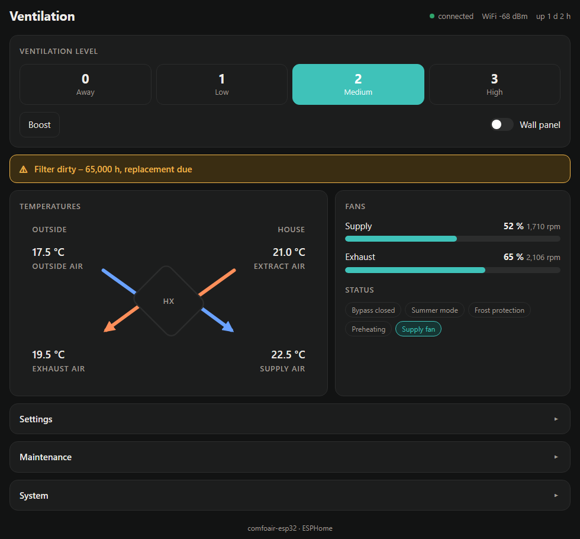

# comfoair-esp32

**Zehnder ComfoAir, StorkAir WHR oder Wernig G90 in Home Assistant einbinden — lokal, ohne Cloud und ohne MQTT.**

[English](README.en.md) · [Projektseite](https://hpralfi.github.io/comfoair-esp32/)

Eine kleine ESP32-Platine für die Buchse **„RS232 PC“** von Lüftungsgeräten mit der Zehnder-Steuerplatine CA350. Sie läuft mit [ESPHome](https://esphome.io) und erscheint in Home Assistant mit über 40 Entitäten: Temperaturen, Lüftungsstufe, Ventilatorleistung und Drehzahl, Bypass, Filterzustand, Frostschutz, Betriebsstunden.

Entstanden ist sie als Ersatz für einen Gira HomeServer mit Moxa-Seriell-Gateway an einer Wernig G90-380. Dort läuft sie seit Oktober 2026.

## Funktionen

- **Native Home-Assistant-Anbindung** über die ESPHome-API — kein MQTT-Broker, keine Cloud
- **Alle Werte des Geräts**: vier Temperaturen, Stufe, Leistung und Drehzahl der Ventilatoren, Bypass, Filter, Frostschutz, Vorheizung, Betriebsstunden je Stufe
- **Steuern**: Lüftungsstufe 0–3, Komforttemperatur, Stufenwerte in Prozent, Stoßlüften-Taster auf der Platine
- **Schalter für das Bedienteil**: CC-Ease / CC-Luxe parallel weiter nutzen oder dunkel schalten, sodass nur Home Assistant bedient (siehe [RS232-Modus](#rs232-modus-und-das-bedienteil))
- **Eigene Weboberfläche** im Browser (mit Anmeldung): Stufenwahl, Wärmetauscher-Schaubild mit allen vier Temperaturen, Ventilatoren, Filterwarnung, Einstellungen, Live-Log, Firmware-Update per Datei — auch ohne Home Assistant, am Handy wie am PC
- **Updates über WLAN** nach dem ersten Flashen
- **USB-C** für Versorgung und Programmierung (CH340K an Bord, automatischer Wechsel in den Bootloader)
- **Zweiter RS232-Kanal** an einer Schraubklemme, vorgesehen für einen späteren Proxy-Betrieb des Bedienteils
- Status-LED (WS2812B) und ein frei belegbarer Taster

## In Home Assistant

Beispiel-Dashboard: Stufenknöpfe, Schalter für das Bedienteil, Ventilatoren, Bypass, Filter, Betriebsstunden und Temperaturverlauf über 24 Stunden.

## Weboberfläche

Unter `http://<adresse-der-platine>/`, eingebettet in die Firmware ([`firmware/webui/comfoair-ui.js`](firmware/webui/comfoair-ui.js)), braucht kein Internet. Wer die Standardansicht von ESPHome bevorzugt, entfernt in der Konfiguration die Zeilen `js_url` und `js_include`.

## Hardware

| | |
|---|---|
| Größe | 70 × 55 mm, 2 Lagen, 1,6 mm |
| Prozessor | ESP32-WROOM-32E (WLAN, Leiterplattenantenne) |
| Pegelwandler | MAX3232 (2 Kanäle) |
| USB | USB-C, CH340K, ESD-Schutz USBLC6 |
| Versorgung | 5 V über USB-C, Regler AP2112K 3,3 V, unter 1 W |
| Anschluss Gerät | **DB9-Stecker**, DTE-Belegung: Pin 2 RX, Pin 3 TX, Pin 5 GND |
| Zweiter Anschluss | 3-polige Schraubklemme (RS232-Kanal 2) |
| Lötbrücken | JP1/JP2 kreuzen RX/TX am DB9 bei Bedarf |

Der DB9 ist belegt wie bei einer Moxa NPort 5110: Hängt am Gerät schon ein Seriell-Gateway oder PC-Kabel, dieses abstecken und die Platine mit demselben Kabel anschließen. An der Wernig G90-380 war kein Kreuzen nötig.

Schaltplan: [`hardware/schematic.pdf`](hardware/schematic.pdf) · KiCad-Projekt: [`hardware/kicad/`](hardware/kicad/) · Fertigungsdaten: [`hardware/production/`](hardware/production/)

## Kompatible Geräte

Das ComfoAir-Seriellprotokoll sprechen viele Geräte und ihre Handelsmarken-Varianten. Die meisten Kompatibilitätsangaben im Netz sind aus derselben Protokollbeschreibung abgeschrieben — deshalb trennt diese Liste **nachgewiesene** von nur **gelisteten** Geräten.

| Gerät | Marke | Status | Hinweis |
|---|---|---|---|
| G90-380 (CS / Luxe) | Wernig | ✅ **mit dieser Platine nachgewiesen** | meldet „CA350 luxe“, Firmware 3.20 |
| G90-160 | Wernig | ✅ nachgewiesen (andere Projekte) | openHAB-Binding |
| ComfoAir 350 | Zehnder | ✅ nachgewiesen (andere Projekte) | Referenzgerät des Protokolls |
| ComfoAir 160 | Zehnder | ✅ nachgewiesen (andere Projekte) | esphome-comfoair |
| ComfoD 450 | Zehnder | ✅ nachgewiesen (andere Projekte) | |
| G90-200 CS | Wernig | 🟡 wahrscheinlich | „RS232 PC“ im Schaltplan |
| ComfoAir 200 / 500 / 550 | Zehnder | 🟡 wahrscheinlich | gelistet, kein Testbericht |
| ComfoD 300 / 350 / 550 | Zehnder | 🟡 wahrscheinlich | gelistet |
| WHR 920 / 930 / 950 / 960 | J.E. StorkAir | 🟡 wahrscheinlich | gelistet |
| Santos 370 DC | Paul | 🟡 wahrscheinlich | gelistet |
| G90-300 | Wernig | ❔ ungeprüft | Schnittstelle nicht bestätigt |
| ComfoAir Q350 / Q450 / Q600, Wernig Q350 / Q600 | Zehnder / Wernig | ❌ nicht kompatibel | CAN / ComfoNet |
| ComfoAir E300 / E350 / E400 | Zehnder | ❌ nicht kompatibel | Modbus RTU (RS485) |
| Novus 300 | Paul | ❌ nicht kompatibel | RS485 |
| Vitovent 300-W | Viessmann | ❌ nicht kompatibel | OpenTherm / Modbus |

**Ein 🟡-Gerät getestet?** Bitte ein Issue anlegen — es wandert dann zu ✅.

### So prüfst du dein Gerät

1. **Typenschild**: eines der Modelle oben. Ein „Q“ oder „E“ im Modellnamen heißt: passt nicht.
2. **Bedienteil**: CC-Ease (Drehrad mit Display), CC-Luxe oder die alte ComfoSense sind gute Zeichen. ComfoConnect, ComfoSense C oder ein Touch-Display deuten auf die Q-Plattform.
3. **Steuerplatine**: CA350 / CA550 mit einem Anschluss **„RS232“** oder **„RS232 PC“**. Bei manchen Geräten ist das keine DB9-Buchse, sondern RJ45 oder Schraubklemmen (RX/TX/GND) — dann braucht es ein Adapterkabel.
4. Auf der Konnektorplatine der Wernig G90-380 CS gibt es zusätzlich **RS485**-Klemmen („Entalpy“, „Hybalans“). Die sind für Zubehör, **nicht** der PC-Anschluss.

## Platine bekommen

### Fertige Platine

Bestückte und geprüfte Platinen: DB9 und Schraubklemme gelötet, Lötbrücken gesetzt, Firmware aufgespielt.

**Fertige Platinen sind in Vorbereitung.** Melde dich unverbindlich — mit Gerätemodell und Land, dann sage ich Bescheid, sobald es losgeht:

📧 **[office@gfrerrer.at](mailto:office@gfrerrer.at?subject=comfoair-esp32%20-%20Interesse)**

### Selbst bauen

1. Bei [JLCPCB](https://jlcpcb.com) mit Bestückung (PCBA) bestellen: [`gerber.zip`](hardware/production/gerber.zip), [`jlcpcb-bom.csv`](hardware/production/jlcpcb-bom.csv) und [`jlcpcb-cpl.csv`](hardware/production/jlcpcb-cpl.csv) hochladen. Die Bestückungsdatei enthält bereits die Dreh- und Lagekorrekturen, die JLCPCB braucht. Die LCSC-Nummern beim Bestellen auf Lagerbestand prüfen.
2. Von Hand löten: **J2** (DB9-Stecker, gewinkelt, mit Befestigungsbohrungen) und **J3** (3-polige Schraubklemme, 5,08 mm). Auch die beiden Befestigungslaschen des DB9 verlöten — sie tragen die Steckkraft. Sie hängen an der Massefläche: breite Meißelspitze, etwa 380 °C.
3. **Lötbrücken JP1 und JP2 auf Pad 1–2 schließen.** Sie sind ab Werk offen — ohne sie ist der DB9 nicht mit dem MAX3232 verbunden und das Gerät bleibt stumm. (Pad 2–3 kreuzt RX/TX, falls das Kabel es braucht.)
4. Firmware aufspielen (unten).

## Firmware

Die Platine nutzt einen Fork von [wichers/esphome-comfoair](https://github.com/wichers/esphome-comfoair) mit zwei Ergänzungen: RS232-Modus setzen (Kommando `0x9B`) und den vom Gerät gemeldeten Modus auswerten (`0x9C`).

1. [`firmware/comfoair-esp32.yaml`](firmware/comfoair-esp32.yaml), den Ordner [`firmware/webui/`](firmware/webui/) und [`firmware/secrets.yaml.example`](firmware/secrets.yaml.example) (als `secrets.yaml`) in den ESPHome-Ordner kopieren und ausfüllen.
2. Erstes Flashen über USB-C, z. B. mit dem ESPHome-Dashboard oder `esphome run comfoair-esp32.yaml`. Die Platine wechselt selbst in den Bootloader.
3. Danach laufen Updates über WLAN.
4. Home Assistant findet das Gerät; den API-Schlüssel eingeben, wenn danach gefragt wird.
5. Webinterface: `http://<adresse-der-platine>/`, Anmeldung mit `web_username` / `web_password` aus `secrets.yaml`. Dort lassen sich auch neue Firmware-Dateien (`.bin`) hochladen.

## RS232-Modus und das Bedienteil

Das Gerät kennt mehrere RS232-Modi. Gemessen an einer CA350 mit Firmware 3.20:

| Modus | Bedeutung | Ergebnis |
|---|---|---|
| 1 „nur PC“ | | **wird quittiert, aber ignoriert** |
| 3 „PC Master“ | | angenommen — **Bedienteil wird dunkel** |
| 0 „Ende“ (aus 3) | zurück auf 2 „nur CC-Ease“ | Bedienteil aktiv, **Home Assistant liest und schaltet trotzdem** |

Der Schalter **„Wall panel“** in Home Assistant wählt zwischen beiden: aus = Modus 3 (Bedienteil dunkel), an = Modus 2 (beide parallel). Nach einem Stromausfall startet das Gerät in Modus 2; die Platine prüft den gemeldeten Modus jede Minute und stellt die Einstellung wieder her.

## Einbau

- Die Platine hängt **nur an der Kleinspannungs-Schnittstelle RS232**. Den Netzspannungsteil des Geräts nicht öffnen.
- Versorgung über ein beliebiges USB-C-Netzteil (5 V, 0,5 A reichen).
- Das Antennenende der Platine frei von Metall halten, dann ist der WLAN-Empfang gut.
- Auf der RS232-Leitung darf nur **ein Master** sprechen: anderes Gateway oder PC vorher abstecken.

## Lizenz

- Hardware (`hardware/`): [CERN-OHL-S-2.0](LICENSE-CERN-OHL-S-2.0)
- Firmware-Konfiguration und Dokumentation: [GPL-3.0](LICENSE-GPL-3.0), wie die zugrunde liegende ESPHome-Komponente

## Haftungsausschluss

Ein unabhängiges Hobbyprojekt ohne Verbindung zu Zehnder Group, J.E. StorkAir, Wernig oder Paul. Marken- und Modellnamen dienen nur zur Angabe der Kompatibilität. Nutzung auf eigene Gefahr.

## Dank

- [wichers/esphome-comfoair](https://github.com/wichers/esphome-comfoair) — die ESPHome-Komponente
- Die ComfoAir-Protokollbeschreibung der Community sowie die Projekte FHEM, openHAB und hacomfoairmqtt
